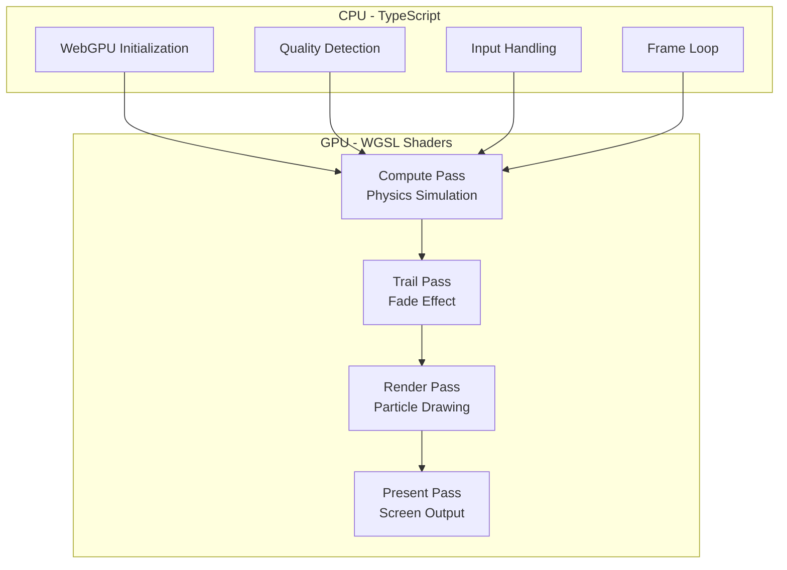
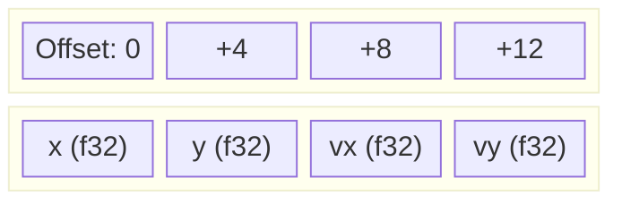

# System Architecture

This technical whitepaper describes the architecture and design decisions for a high-performance particle fluid simulation using WebGPU.

## Overview

The system leverages **GPU parallel computing** via Compute Shaders to achieve real-time physics simulation for thousands of particles. The architecture follows a **heterogeneous computing model** where CPU handles orchestration and GPU handles parallel computation.

## CPU-GPU Architecture

## Four-Stage Render Pipeline

The simulation runs through four distinct GPU passes each frame:

### 1. Compute Pass

Parallel physics simulation for all particles:

**Workgroup Configuration:**

| Parameter        | Value                      | Purpose                            |
| ---------------- | -------------------------- | ---------------------------------- |
| `workgroup_size` | 64                         | Optimal for most GPU architectures |
| Dispatch         | `ceil(particleCount / 64)` | One thread per particle            |

### 2. Trail Pass

Fades the persistent offscreen texture:

- Draws a fullscreen quad
- Alpha blending with `TRAIL_FADE_ALPHA = 0.05`
- Creates the motion trail effect

### 3. Render Pass

Draws particles to offscreen texture:

- Point primitives (one per particle)
- Velocity-to-color mapping
- HiDPI-aware scaling

### 4. Present Pass

Composites to the screen:

- Samples offscreen texture
- Bilinear filtering for smoothness
- Outputs to swapchain

## Data Layouts

### Particle Buffer

Each particle: **16 bytes** (4 × float32)

| Field | Type | Description         |
| ----- | ---- | ------------------- |
| `x`   | f32  | Position X (pixels) |
| `y`   | f32  | Position Y (pixels) |
| `vx`  | f32  | Velocity X (px/s)   |
| `vy`  | f32  | Velocity Y (px/s)   |

### Uniform Buffer

Total: **32 bytes** (8 × float32)

| Offset | Field     | Type | Purpose           |
| ------ | --------- | ---- | ----------------- |
| 0      | width     | f32  | Canvas width      |
| 4      | height    | f32  | Canvas height     |
| 8      | mouseX    | f32  | Mouse X position  |
| 12     | mouseY    | f32  | Mouse Y position  |
| 16     | deltaTime | f32  | Frame time        |
| 20-28  | \_pad     | f32  | Alignment padding |

## Key Design Decisions

| Decision                           | Rationale                                  |
| ---------------------------------- | ------------------------------------------ |
| **Offscreen trail texture**        | More portable than swapchain persistence   |
| **Shared constants via preamble**  | Single source of truth for TypeScript/WGSL |
| **CPU reference implementations**  | Enables property testing of GPU logic      |
| **Adaptive particle count**        | Graceful degradation on low-end devices    |
| **Frame-rate independent physics** | Consistent simulation across refresh rates |

## Frame Budget

| Metric       | Target | Notes                                |
| ------------ | ------ | ------------------------------------ |
| Frame time   | < 16ms | 60 FPS target                        |
| Compute pass | ~2-4ms | Physics for 10K particles            |
| Render pass  | ~1-2ms | Point rendering                      |
| CPU overhead | < 1ms  | Uniform updates, frame orchestration |

## Source Files

| Module      | Path                    | Purpose               |
| ----------- | ----------------------- | --------------------- |
| WebGPU Init | `src/core/webgpu.ts`    | GPU initialization    |
| Buffers     | `src/core/buffers.ts`   | Memory management     |
| Physics     | `src/core/physics.ts`   | CPU reference         |
| Pipelines   | `src/core/pipelines.ts` | GPU pipeline creation |
| Renderer    | `src/core/renderer.ts`  | Frame orchestration   |
| Quality     | `src/core/quality.ts`   | Adaptive scaling      |

## Next Steps

- [Compute Shader Design](/en/whitepaper/compute-shader) - Deep dive into physics simulation
- [Render Pipeline](/en/whitepaper/render-pipeline) - Visualization architecture
- [Adaptive Quality System](/en/whitepaper/quality-system) - Performance scaling
