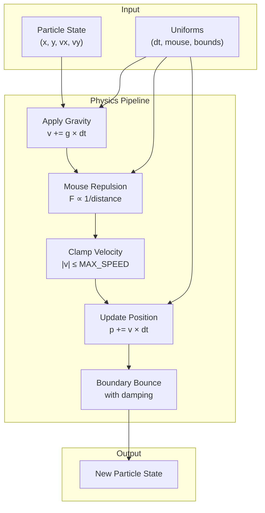
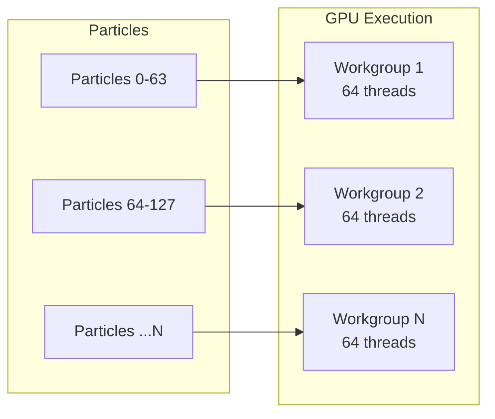

# Compute Shader Design

Deep dive into the GPU physics simulation using WebGPU Compute Shaders.

## Overview

The compute shader handles all physics calculations in parallel on the GPU. Each particle is processed by a single GPU thread, allowing thousands of particles to update simultaneously.

## Shader Structure

```wgsl
@compute @workgroup_size(64)
fn main(@builtin(global_invocation_id) id: vec3u) {
    // Thread safety: bounds check
    if (id.x >= arrayLength(&particles)) { return; }

    // Physics pipeline
    let particle = particles[id.x];
    var velocity = particle.velocity;
    var position = particle.position;

    // 1. Apply gravity
    // 2. Apply mouse repulsion
    // 3. Clamp velocity
    // 4. Update position
    // 5. Boundary bounce

    particles[id.x] = particle;
}
```

## Physics Pipeline



## Step-by-Step Breakdown

### 1. Gravity Application

```wgsl
velocity.x += GRAVITY.x * deltaTime;
velocity.y += GRAVITY.y * deltaTime;
```

Default: `{x: 0, y: 600}` px/s² (downward acceleration)

### 2. Mouse Repulsion

```wgsl
let dx = position.x - mouseX;
let dy = position.y - mouseY;
let dist = sqrt(dx * dx + dy * dy);

if (dist < REPULSION_RADIUS && dist > 0.0) {
    let strength = REPULSION_STRENGTH / dist;
    velocity.x += (dx / dist) * strength * deltaTime;
    velocity.y += (dy / dist) * strength * deltaTime;
}
```

**Inverse distance falloff** creates natural push-away effect.

### 3. Velocity Clamping

```wgsl
let speed = sqrt(velocity.x * velocity.x + velocity.y * velocity.y);
if (speed > MAX_SPEED) {
    velocity = velocity * (MAX_SPEED / speed);
}
```

Prevents particles from moving too fast, maintaining visual coherence.

### 4. Position Update

```wgsl
position.x += velocity.x * deltaTime;
position.y += velocity.y * deltaTime;
```

Delta-time based movement ensures consistent physics regardless of frame rate.

### 5. Boundary Bounce

```wgsl
if (position.x < 0.0) {
    position.x = 0.0;
    velocity.x = -velocity.x * DAMPING;
}
// Similar for all four boundaries
```

Elastic collision with `DAMPING = 0.9` (90% energy retention).

## Constants Configuration

| Constant             | Value            | Unit  | Purpose                 |
| -------------------- | ---------------- | ----- | ----------------------- |
| `GRAVITY`            | `{x: 0, y: 600}` | px/s² | Downward acceleration   |
| `REPULSION_RADIUS`   | 200              | px    | Mouse influence area    |
| `REPULSION_STRENGTH` | 3000             | px/s  | Push force magnitude    |
| `MAX_SPEED`          | 800              | px/s  | Velocity ceiling        |
| `DAMPING`            | 0.9              | ratio | Bounce energy retention |

## Workgroup Sizing



**Why 64?**

- Optimal for most GPU architectures
- Good balance of parallelism and register usage
- Matches common GPU warp/wavefront sizes

## CPU Reference Implementation

The TypeScript implementation in `src/core/physics.ts` mirrors the WGSL logic exactly:

```typescript
function updateParticle(
  particle: Particle,
  canvasSize: Vec2,
  mousePos: Vec2,
  deltaTime: number,
  gravity: Vec2
): Particle {
  // 1. Apply gravity
  particle.vx += gravity.x * deltaTime;
  particle.vy += gravity.y * deltaTime;

  // 2. Mouse repulsion
  // 3. Clamp velocity
  // 4. Update position
  // 5. Boundary bounce

  return particle;
}
```

This enables **property-based testing** to validate GPU behavior.

## Performance Characteristics

| Metric             | 10K Particles  | 2.5K Particles |
| ------------------ | -------------- | -------------- |
| Compute dispatches | 157 workgroups | 40 workgroups  |
| Typical GPU time   | 2-4 ms         | 0.5-1 ms       |
| Memory bandwidth   | ~320 KB/frame  | ~80 KB/frame   |

## Common Pitfalls

| Issue               | Symptom           | Fix                                   |
| ------------------- | ----------------- | ------------------------------------- |
| Race conditions     | Particles flicker | Use single buffer, no atomics needed  |
| Delta time overflow | Physics explosion | Clamp `deltaTime` to `MAX_DELTA_TIME` |
| Division by zero    | NaN propagation   | Check `dist > 0` before division      |
| Buffer misalignment | GPU crash         | Ensure 16-byte particle alignment     |

## Source Files

| File                       | Purpose                      |
| -------------------------- | ---------------------------- |
| `src/shaders/compute.wgsl` | GPU shader code              |
| `src/core/physics.ts`      | CPU reference implementation |
| `src/config/sim.ts`        | Constants definition         |
| `src/core/pipelines.ts`    | Pipeline creation            |

## Next Steps

- [Render Pipeline](/en/whitepaper/render-pipeline) - How particles are drawn
- [Adaptive Quality](/en/whitepaper/quality-system) - Performance scaling
