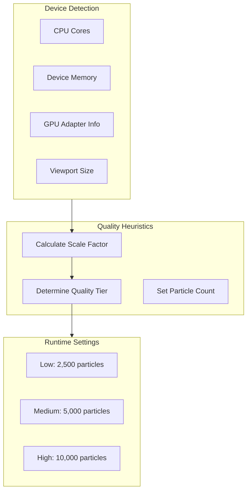
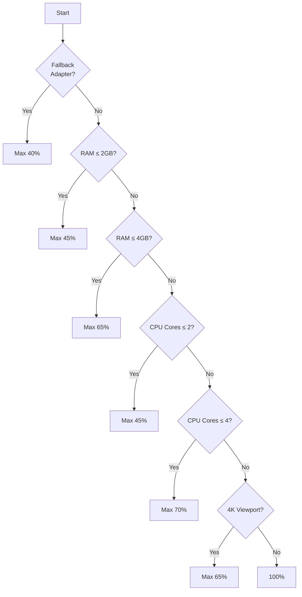

# Adaptive Quality System

Runtime particle count adjustment based on device capabilities.

## Overview

The quality system ensures smooth performance across a wide range of devices by dynamically adjusting the particle count at startup.



## Detection Inputs

```typescript
interface SimulationHeuristicsInput {
  hardwareConcurrency?: number; // CPU cores
  deviceMemory?: number; // Device RAM (GB)
  isFallbackAdapter: boolean; // Software rendering?
  maxStorageBufferBindingSize: number;
  viewportPixels: number; // Width × Height × DPR²
}
```

| Input                 | Source                          | Range   |
| --------------------- | ------------------------------- | ------- |
| `hardwareConcurrency` | `navigator.hardwareConcurrency` | 1-64+   |
| `deviceMemory`        | `navigator.deviceMemory`        | 1-8+ GB |
| `isFallbackAdapter`   | `adapter.isFallbackAdapter`     | boolean |
| `viewportPixels`      | Canvas dimensions × DPR²        | varies  |

## Scaling Rules



| Condition        | Max Scale | Particle Count |
| ---------------- | --------- | -------------- |
| Fallback adapter | 40%       | 4,000          |
| RAM ≤ 2 GB       | 45%       | 4,500          |
| RAM ≤ 4 GB       | 65%       | 6,500          |
| CPU cores ≤ 2    | 45%       | 4,500          |
| CPU cores ≤ 4    | 70%       | 7,000          |
| 4K viewport      | 65%       | 6,500          |
| QHD viewport     | 85%       | 8,500          |
| High-end device  | 100%      | 10,000         |

## Quality Tiers

```typescript
type SimulationQualityTier = 'low' | 'medium' | 'high';

interface RuntimeSimulationSettings {
  particleCount: number;
  qualityTier: SimulationQualityTier;
  scale: number;
}
```

| Tier   | Particle Count | Target Devices                   |
| ------ | -------------- | -------------------------------- |
| Low    | 2,500          | Integrated GPUs, 4GB RAM, mobile |
| Medium | 5,000          | Mid-range laptops, 8GB RAM       |
| High   | 10,000         | Dedicated GPUs, 16GB+ RAM        |

## Implementation

```typescript
function resolveSimulationSettings(
  input: SimulationHeuristicsInput,
  preferredParticleCount?: number
): RuntimeSimulationSettings {
  const target = preferredParticleCount ?? PARTICLE_COUNT;
  let scale = 1.0;

  // Apply heuristics
  if (input.isFallbackAdapter) {
    scale = Math.min(scale, 0.4);
  }
  if (input.deviceMemory !== undefined) {
    if (input.deviceMemory <= 2) scale = Math.min(scale, 0.45);
    else if (input.deviceMemory <= 4) scale = Math.min(scale, 0.65);
  }
  // ... more heuristics

  const particleCount = Math.floor(target * scale);
  const tier = particleCount <= 3000 ? 'low' : particleCount <= 6000 ? 'medium' : 'high';

  return { particleCount, qualityTier: tier, scale };
}
```

## Device Examples

| Device           | Cores | RAM   | Viewport | Result           |
| ---------------- | ----- | ----- | -------- | ---------------- |
| MacBook Pro M1   | 8     | 16 GB | 1440p    | 10,000 (high)    |
| Surface Laptop   | 4     | 8 GB  | 1080p    | 7,000 (medium)   |
| Budget Laptop    | 2     | 4 GB  | 1080p    | 4,500 (low)      |
| Desktop RTX 3080 | 16    | 32 GB | 4K       | 6,500 (medium\*) |

\*4K viewport triggers 65% cap

## Why Not Runtime Adjustment?

The system sets particle count **once at startup** rather than dynamically:

**Advantages:**

- Predictable memory allocation
- No runtime stutter from buffer reallocation
- Simpler testing and debugging

**Trade-offs:**

- Cannot adapt to changing conditions
- User must refresh for different quality

## Browser Compatibility

```typescript
// Fallback for missing APIs
const hardwareConcurrency = navigator.hardwareConcurrency ?? 4;
const deviceMemory = (navigator as any).deviceMemory ?? 8;
```

| Browser | `hardwareConcurrency` | `deviceMemory`     |
| ------- | --------------------- | ------------------ |
| Chrome  | ✅                    | ✅                 |
| Firefox | ✅                    | ❌ (defaults to 8) |
| Safari  | ✅                    | ❌ (defaults to 8) |
| Edge    | ✅                    | ✅                 |

## User Override

Users can force a specific particle count via URL parameter:

```
?particles=5000
```

This bypasses heuristics for testing or specific use cases.

## Source Files

| File                  | Purpose                   |
| --------------------- | ------------------------- |
| `src/core/quality.ts` | Heuristics implementation |
| `src/core/webgpu.ts`  | Device info gathering     |

## Next Steps

- [Performance Guide](/en/performance) - Optimization tips
- [API Reference](/en/api/) - Configuration options
