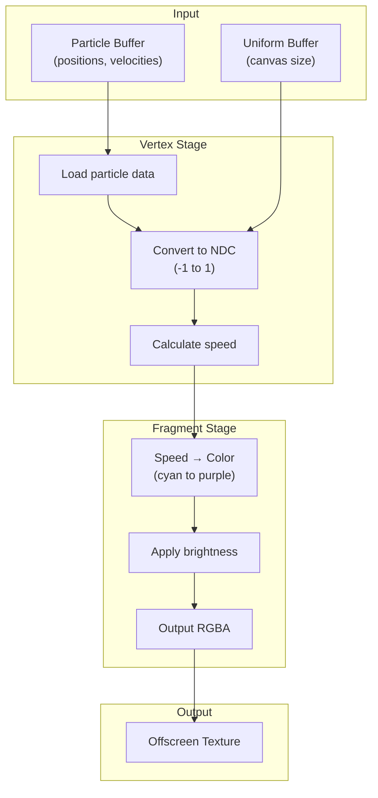
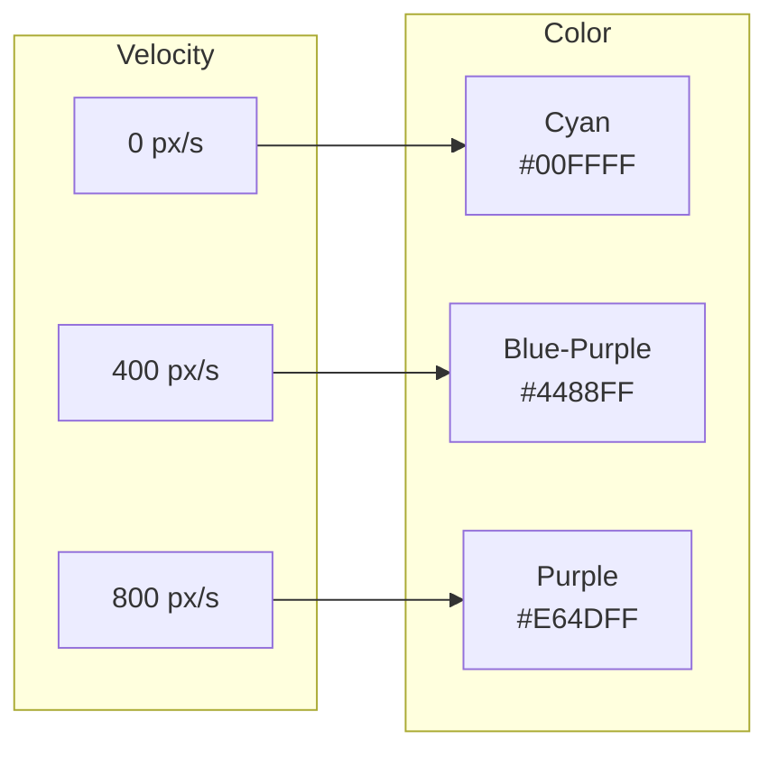
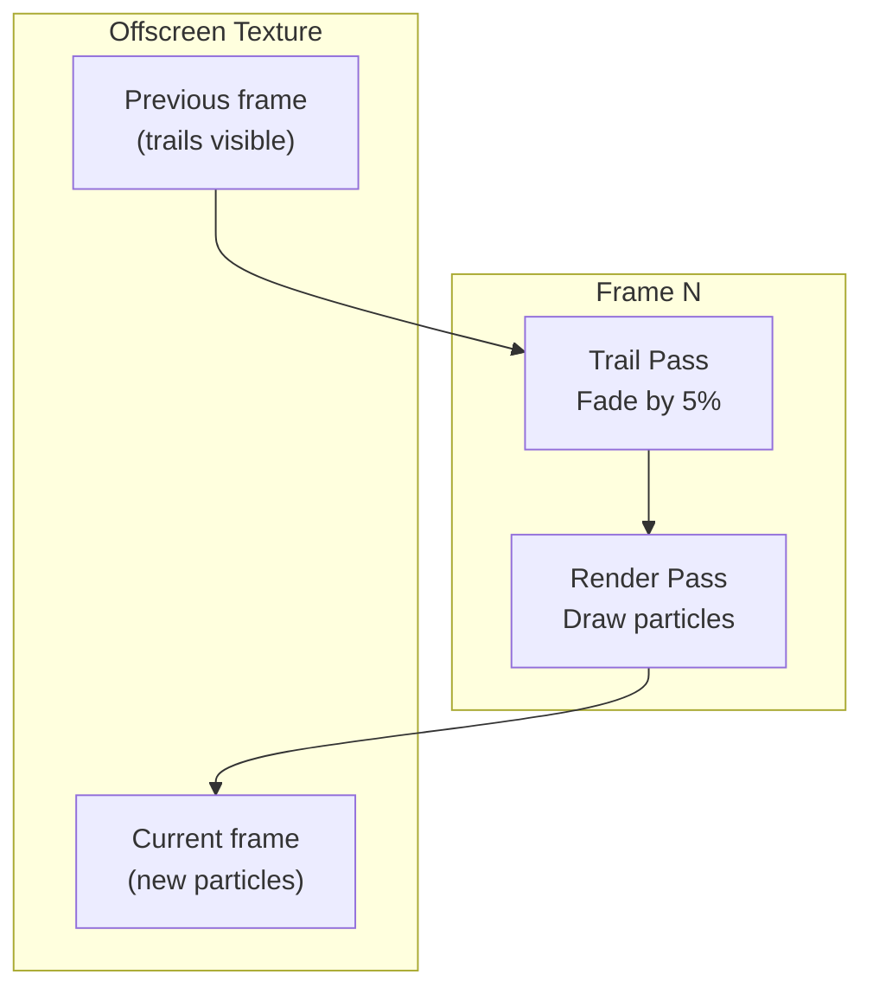

# Render Pipeline

Visualization architecture for the particle simulation.

## Overview

The render pipeline transforms particle physics state into visual output through a multi-stage process optimized for WebGPU.

## Pipeline Architecture



## Four-Pass Rendering

### Pass 1: Compute

Physics simulation (covered in [Compute Shader Design](/en/whitepaper/compute-shader)).

### Pass 2: Trail

```wgsl
@fragment
fn fragmentMain() -> vec4f {
    return vec4f(0.0, 0.0, 0.0, TRAIL_FADE_ALPHA);
}
```

Fades the persistent offscreen texture by 5% each frame.

### Pass 3: Render

Draws particles as colored points:

```wgsl
@vertex
fn vertexMain(vertexIndex: u32) -> VertexOutput {
    let particle = particles[vertexIndex];
    let ndc = vec2f(
        particle.x / width * 2.0 - 1.0,
        particle.y / height * 2.0 - 1.0
    );

    let speed = length(particle.velocity);
    let t = clamp(speed / MAX_SPEED, 0.0, 1.0);

    return VertexOutput(ndc, t);
}

@fragment
fn fragmentMain(speedFactor: f32) -> vec4f {
    let color = mix(CYAN, PURPLE, speedFactor);
    let brightness = 0.5 + speedFactor * 0.5;
    return vec4f(color * brightness, 1.0);
}
```

### Pass 4: Present

Composites the offscreen texture to the screen with bilinear sampling.

## Color Mapping



| Speed | Color        | RGB               |
| ----- | ------------ | ----------------- |
| 0     | Cyan         | `(0, 1, 1)`       |
| 400   | Interpolated | `(0.45, 0.65, 1)` |
| 800   | Purple       | `(0.9, 0.3, 1)`   |

**Brightness scaling:** 50% at rest → 100% at max speed.

## Offscreen Texture Strategy



**Benefits:**

- Trail persistence without swapchain dependency
- Consistent behavior across browsers
- Easy HiDPI handling

## HiDPI Support

```typescript
const dpr = window.devicePixelRatio || 1;
canvas.width = canvas.clientWidth * dpr;
canvas.height = canvas.clientHeight * dpr;
```

| Display             | Canvas Size | Particles Rendered |
| ------------------- | ----------- | ------------------ |
| 1080p @ 1x          | 1920×1080   | Standard density   |
| 1080p @ 2x (Retina) | 3840×2160   | 4x pixel density   |
| 4K @ 1x             | 3840×2160   | 4x area            |

## Point Rendering

```wgsl
// Vertex shader output
@builtin(position) position: vec4f

// Automatic point size (WebGPU default: 1.0)
// Particles render as single pixels
```

For larger particles, modify the vertex shader:

```wgsl
@vertex
fn vertexMain(...) -> VertexOutput {
    output.pointSize = 2.0; // 2x2 pixel particles
    return output;
}
```

## Pipeline Configuration

```typescript
const renderPipeline = device.createRenderPipeline({
  layout: 'auto',
  vertex: {
    module: shaderModule,
    entryPoint: 'vertexMain',
  },
  fragment: {
    module: shaderModule,
    entryPoint: 'fragmentMain',
    targets: [
      {
        format: offscreenTextureFormat,
        blend: {
          color: { srcFactor: 'src-alpha', dstFactor: 'one' },
          alpha: { srcFactor: 'one', dstFactor: 'one' },
        },
      },
    ],
  },
  primitive: {
    topology: 'point-list',
  },
});
```

## Blend Modes

| Pass    | Blend Mode                          | Purpose                      |
| ------- | ----------------------------------- | ---------------------------- |
| Trail   | `src-alpha * src + dst * (1 - src)` | Fade overlay                 |
| Render  | `src + dst` (additive)              | Bright particle accumulation |
| Present | `src` (replace)                     | Direct copy                  |

## Performance Notes

| Optimization            | Impact                    |
| ----------------------- | ------------------------- |
| Point primitives        | Minimal vertex processing |
| Offscreen texture reuse | No per-frame allocation   |
| Additive blending       | No readback needed        |
| Single buffer           | Direct vertex access      |

## Source Files

| File                       | Purpose            |
| -------------------------- | ------------------ |
| `src/shaders/render.wgsl`  | Particle rendering |
| `src/shaders/trail.wgsl`   | Trail fade effect  |
| `src/shaders/present.wgsl` | Screen compositing |
| `src/core/pipelines.ts`    | Pipeline creation  |

## Next Steps

- [Adaptive Quality System](/en/whitepaper/quality-system) - Performance scaling
- [Performance Guide](/en/performance) - Optimization tips
