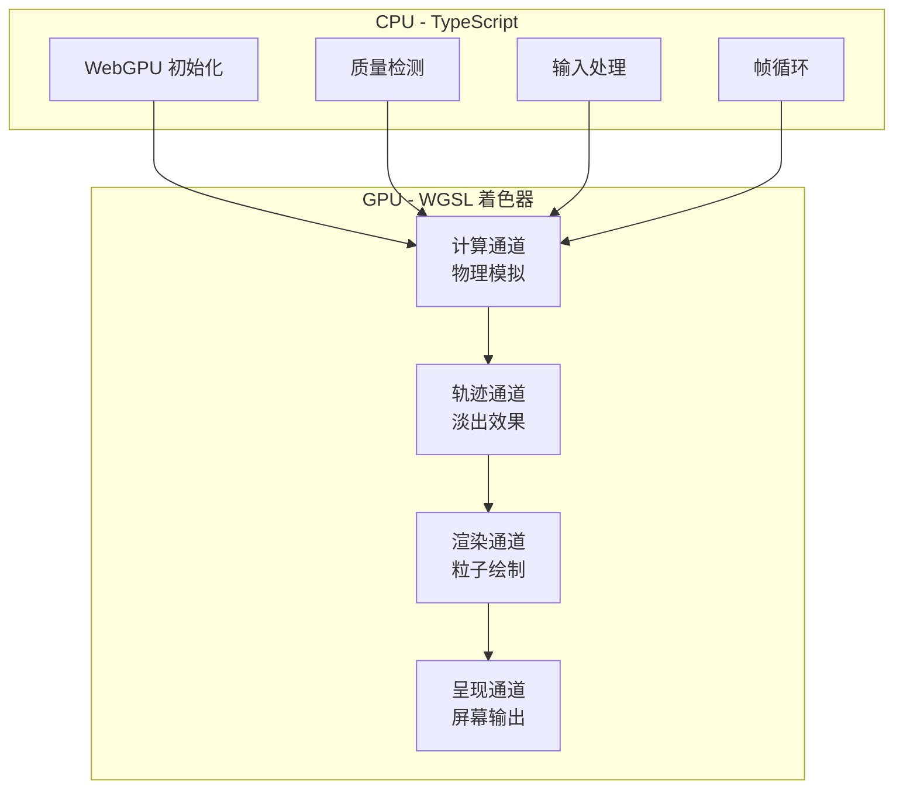

# 系统架构

本技术白皮书描述了基于 WebGPU 的高性能粒子流体模拟的架构与设计决策。

## 概述

系统通过 **Compute Shaders** 利用 **GPU 并行计算**实现数千粒子的实时物理模拟。架构遵循 **异构计算模型**，CPU 负责调度编排，GPU 负责并行计算。

## CPU-GPU 架构

## 四阶段渲染管线

每帧运行四个独立的 GPU 通道：

### 1. 计算通道（Compute Pass）

所有粒子的并行物理模拟：

**工作组配置：**

| 参数             | 值                         | 用途                    |
| ---------------- | -------------------------- | ----------------------- |
| `workgroup_size` | 64                         | 针对大多数 GPU 架构优化 |
| 调度次数         | `ceil(particleCount / 64)` | 每粒子一线程            |

### 2. 轨迹通道（Trail Pass）

淡出持久离屏纹理：

- 绘制全屏四边形
- Alpha 混合，`TRAIL_FADE_ALPHA = 0.05`
- 产生运动轨迹效果

### 3. 渲染通道（Render Pass）

将粒子绘制到离屏纹理：

- 点图元（每粒子一个点）
- 速度到颜色映射
- HiDPI 感知缩放

### 4. 呈现通道（Present Pass）

合成到屏幕：

- 采样离屏纹理
- 双线性过滤平滑处理
- 输出到交换链

## 数据布局

### 粒子缓冲区

每个粒子：**16 字节**（4 × float32）

| 偏移 | 字段 | 类型 | 描述              |
| ---- | ---- | ---- | ----------------- |
| 0    | x    | f32  | 位置 X（像素）    |
| 4    | y    | f32  | 位置 Y（像素）    |
| 8    | vx   | f32  | 速度 X（像素/秒） |
| 12   | vy   | f32  | 速度 Y（像素/秒） |

### 均匀缓冲区

总计：**32 字节**（8 × float32）

| 偏移  | 字段      | 类型 | 用途        |
| ----- | --------- | ---- | ----------- |
| 0     | width     | f32  | 画布宽度    |
| 4     | height    | f32  | 画布高度    |
| 8     | mouseX    | f32  | 鼠标 X 位置 |
| 12    | mouseY    | f32  | 鼠标 Y 位置 |
| 16    | deltaTime | f32  | 帧时间      |
| 20-28 | \_pad     | f32  | 对齐填充    |

## 关键设计决策

| 决策                 | 理由                           |
| -------------------- | ------------------------------ |
| **离屏轨迹纹理**     | 比依赖交换链持久性更具可移植性 |
| **通过前言共享常量** | TypeScript/WGSL 的单一事实来源 |
| **CPU 参考实现**     | 支持对 GPU 逻辑进行属性测试    |
| **自适应粒子数量**   | 低端设备优雅降级               |
| **帧率无关物理**     | 不同刷新率下模拟一致           |

## 帧预算

| 指标     | 目标   | 备注             |
| -------- | ------ | ---------------- |
| 帧时间   | < 16ms | 60 FPS 目标      |
| 计算通道 | ~2-4ms | 10K 粒子物理     |
| 渲染通道 | ~1-2ms | 点渲染           |
| CPU 开销 | < 1ms  | 均匀更新、帧编排 |

## 源文件

| 模块          | 路径                    | 用途         |
| ------------- | ----------------------- | ------------ |
| WebGPU 初始化 | `src/core/webgpu.ts`    | GPU 初始化   |
| 缓冲区        | `src/core/buffers.ts`   | 内存管理     |
| 物理          | `src/core/physics.ts`   | CPU 参考     |
| 管线          | `src/core/pipelines.ts` | GPU 管线创建 |
| 渲染器        | `src/core/renderer.ts`  | 帧编排       |
| 质量          | `src/core/quality.ts`   | 自适应缩放   |

## 下一步

- [计算着色器设计](/zh/whitepaper/compute-shader) - 物理模拟深入解析
- [渲染管线](/zh/whitepaper/render-pipeline) - 可视化架构
- [自适应质量系统](/zh/whitepaper/quality-system) - 性能缩放
