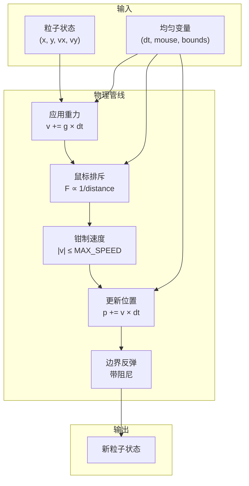

# 计算着色器设计

深入解析使用 WebGPU Compute Shaders 的 GPU 物理模拟。

## 概述

计算着色器在 GPU 上并行处理所有物理计算。每个粒子由单个 GPU 线程处理，使数千粒子能够同时更新。

## 着色器结构

```wgsl
@compute @workgroup_size(64)
fn main(@builtin(global_invocation_id) id: vec3u) {
    // 线程安全：边界检查
    if (id.x >= arrayLength(&particles)) { return; }

    // 物理管线
    let particle = particles[id.x];
    var velocity = particle.velocity;
    var position = particle.position;

    // 1. 应用重力
    // 2. 应用鼠标排斥
    // 3. 钳制速度
    // 4. 更新位置
    // 5. 边界反弹

    particles[id.x] = particle;
}
```

## 物理管线



## 步骤详解

### 1. 重力应用

```wgsl
velocity.x += GRAVITY.x * deltaTime;
velocity.y += GRAVITY.y * deltaTime;
```

默认值：`{x: 0, y: 600}` px/s²（向下加速度）

### 2. 鼠标排斥

```wgsl
let dx = position.x - mouseX;
let dy = position.y - mouseY;
let dist = sqrt(dx * dx + dy * dy);

if (dist < REPULSION_RADIUS && dist > 0.0) {
    let strength = REPULSION_STRENGTH / dist;
    velocity.x += (dx / dist) * strength * deltaTime;
    velocity.y += (dy / dist) * strength * deltaTime;
}
```

**反距离衰减**产生自然的推开效果。

### 3. 速度钳制

```wgsl
let speed = sqrt(velocity.x * velocity.x + velocity.y * velocity.y);
if (speed > MAX_SPEED) {
    velocity = velocity * (MAX_SPEED / speed);
}
```

防止粒子移动过快，保持视觉一致性。

### 4. 位置更新

```wgsl
position.x += velocity.x * deltaTime;
position.y += velocity.y * deltaTime;
```

基于 delta-time 的移动确保无论帧率如何物理表现一致。

### 5. 边界反弹

```wgsl
if (position.x < 0.0) {
    position.x = 0.0;
    velocity.x = -velocity.x * DAMPING;
}
// 四个边界类似处理
```

弹性碰撞，`DAMPING = 0.9`（90% 能量保留）。

## 常量配置

| 常量                 | 值               | 单位  | 用途         |
| -------------------- | ---------------- | ----- | ------------ |
| `GRAVITY`            | `{x: 0, y: 600}` | px/s² | 向下加速度   |
| `REPULSION_RADIUS`   | 200              | px    | 鼠标影响区域 |
| `REPULSION_STRENGTH` | 3000             | px/s  | 排斥力强度   |
| `MAX_SPEED`          | 800              | px/s  | 速度上限     |
| `DAMPING`            | 0.9              | 比例  | 反弹能量保留 |

## 源文件

| 文件                       | 用途           |
| -------------------------- | -------------- |
| `src/shaders/compute.wgsl` | GPU 着色器代码 |
| `src/core/physics.ts`      | CPU 参考实现   |
| `src/config/sim.ts`        | 常量定义       |
| `src/core/pipelines.ts`    | 管线创建       |

## 下一步

- [渲染管线](/zh/whitepaper/render-pipeline) - 粒子如何绘制
- [自适应质量](/zh/whitepaper/quality-system) - 性能缩放
