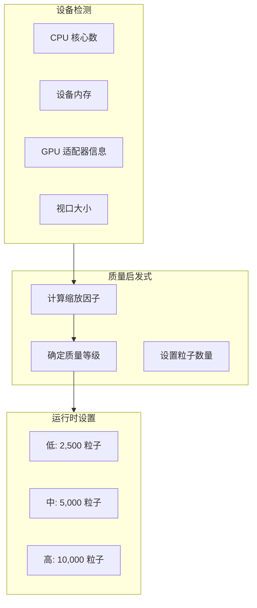

# 自适应质量系统

基于设备能力的运行时粒子数量调整。

## 概述

质量系统通过在启动时动态调整粒子数量，确保在各种设备上获得流畅的性能表现。



## 检测输入

```typescript
interface SimulationHeuristicsInput {
  hardwareConcurrency?: number; // CPU 核心数
  deviceMemory?: number; // 设备内存 (GB)
  isFallbackAdapter: boolean; // 软件渲染？
  maxStorageBufferBindingSize: number;
  viewportPixels: number; // 宽度 × 高度 × DPR²
}
```

| 输入                  | 来源                            | 范围    |
| --------------------- | ------------------------------- | ------- |
| `hardwareConcurrency` | `navigator.hardwareConcurrency` | 1-64+   |
| `deviceMemory`        | `navigator.deviceMemory`        | 1-8+ GB |
| `isFallbackAdapter`   | `adapter.isFallbackAdapter`     | 布尔值  |
| `viewportPixels`      | 画布尺寸 × DPR²                 | 可变    |

## 缩放规则

| 条件           | 最大缩放 | 粒子数量 |
| -------------- | -------- | -------- |
| 回退适配器     | 40%      | 4,000    |
| RAM ≤ 2 GB     | 45%      | 4,500    |
| RAM ≤ 4 GB     | 65%      | 6,500    |
| CPU 核心数 ≤ 2 | 45%      | 4,500    |
| CPU 核心数 ≤ 4 | 70%      | 7,000    |
| 4K 视口        | 65%      | 6,500    |
| QHD 视口       | 85%      | 8,500    |
| 高端设备       | 100%     | 10,000   |

## 质量等级

```typescript
type SimulationQualityTier = 'low' | 'medium' | 'high';
```

| 等级 | 粒子数量 | 目标设备                    |
| ---- | -------- | --------------------------- |
| 低   | 2,500    | 集成显卡、4GB RAM、移动设备 |
| 中   | 5,000    | 中端笔记本、8GB RAM         |
| 高   | 10,000   | 独立显卡、16GB+ RAM         |

## 源文件

| 文件                  | 用途         |
| --------------------- | ------------ |
| `src/core/quality.ts` | 启发式实现   |
| `src/core/webgpu.ts`  | 设备信息收集 |

## 下一步

- [性能指南](/zh/performance) - 优化技巧
- [API 参考](/zh/api/) - 配置选项
