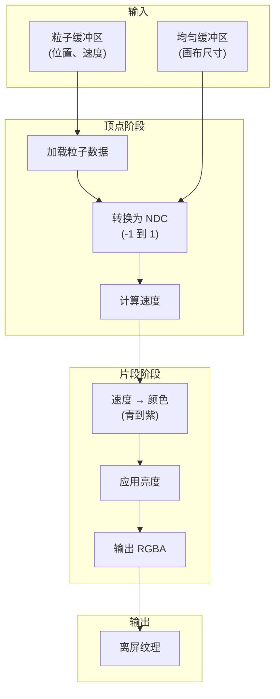
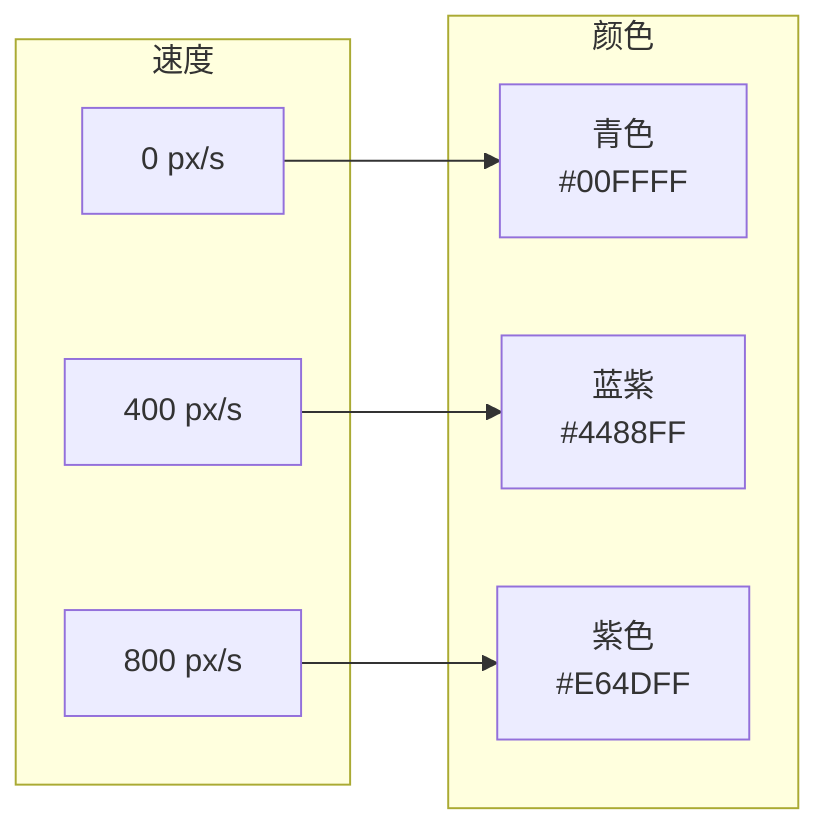

# 渲染管线

粒子模拟的可视化架构。

## 概述

渲染管线通过多阶段流程将粒子物理状态转换为视觉输出，针对 WebGPU 优化。

## 管线架构

## 颜色映射

| 速度 | 颜色 | RGB               |
| ---- | ---- | ----------------- |
| 0    | 青色 | `(0, 1, 1)`       |
| 400  | 插值 | `(0.45, 0.65, 1)` |
| 800  | 紫色 | `(0.9, 0.3, 1)`   |

**亮度缩放：** 静止时 50% → 最大速度时 100%。

## 源文件

| 文件                       | 用途         |
| -------------------------- | ------------ |
| `src/shaders/render.wgsl`  | 粒子渲染     |
| `src/shaders/trail.wgsl`   | 轨迹淡出效果 |
| `src/shaders/present.wgsl` | 屏幕合成     |
| `src/core/pipelines.ts`    | 管线创建     |

## 下一步

- [自适应质量系统](/zh/whitepaper/quality-system) - 性能缩放
- [性能指南](/zh/performance) - 优化技巧
